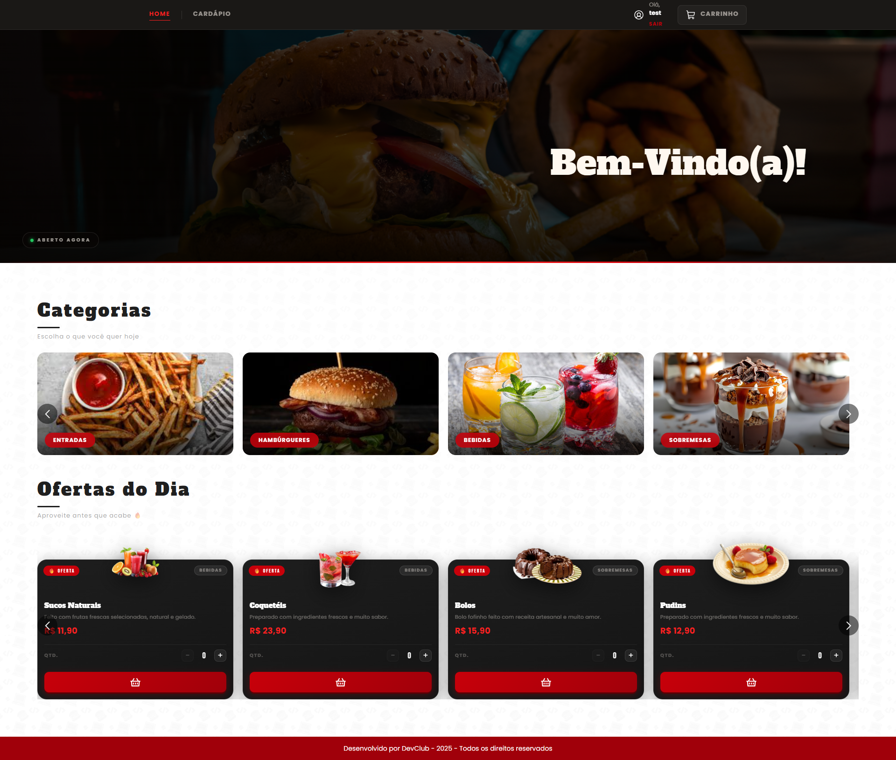
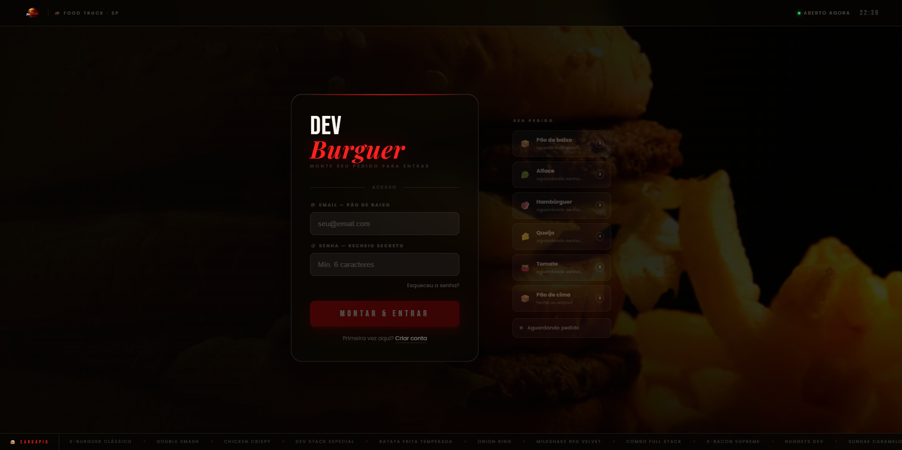
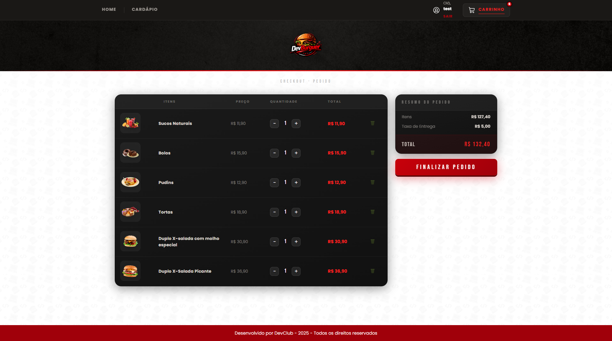
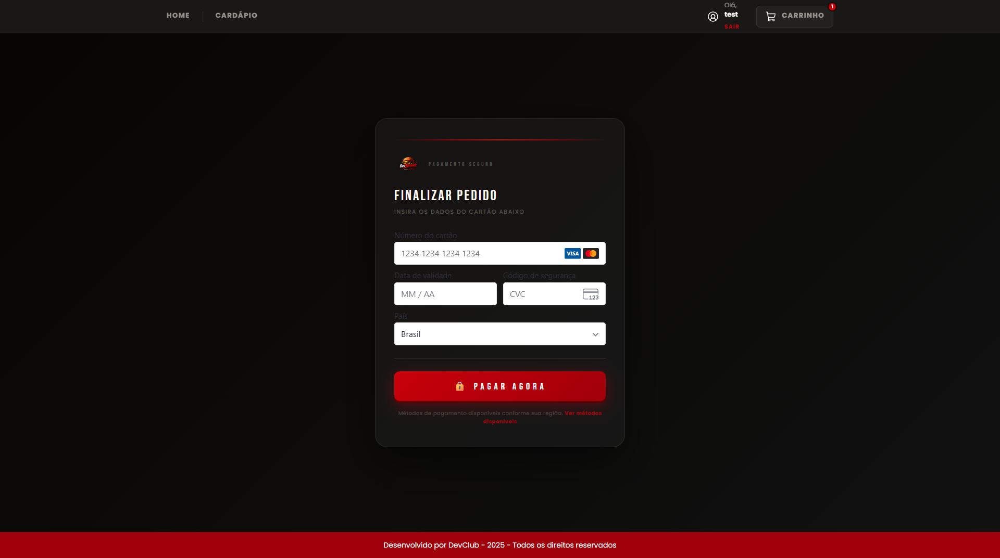
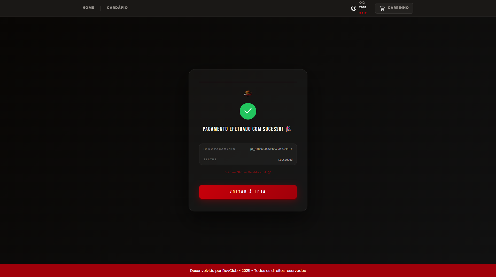
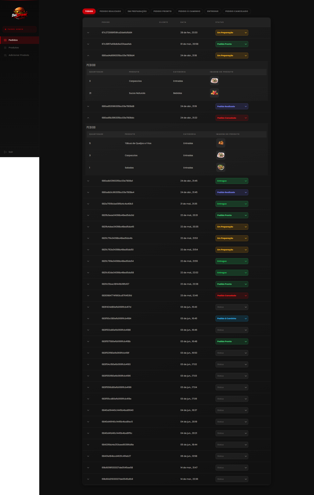
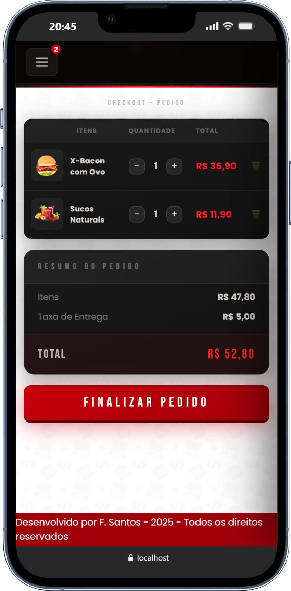

<div align="center">


# 🍔 DevBurguer

### Sistema completo de gerenciamento de pedidos para restaurantes

Aplicação full-stack que simula um ambiente real de pedidos, com fluxo completo do cliente ao painel administrativo.

[](https://reactjs.org/)
[](https://nodejs.org/)
[](https://www.postgresql.org/)
[](https://stripe.com/)
[](https://jwt.io/)
[](https://docker.com/)

**[🚀 Ver Projeto](https://devburger-app.netlify.app/)** · **[🔒 Backend privado (estratégia comercial)](#)**

</div>

---

## 📸 Visão geral



---

## 🧠 Sobre o projeto

O **DevBurguer** é uma aplicação full-stack que simula um sistema real de restaurante, permitindo gerenciar pedidos, visualizar produtos e acompanhar todo o fluxo de atendimento em tempo real.

O sistema cobre todo o ciclo de um pedido — do cardápio ao pagamento — incluindo um painel administrativo completo.

> 💡 Projeto inspirado em sistemas reais utilizados por restaurantes  
> 🔒 Backend mantido privado por estratégia comercial

---

## 🔄 Fluxo do sistema

1. Cliente acessa o cardápio  
2. Adiciona produtos ao carrinho  
3. Finaliza o pedido  
4. Pagamento processado com Stripe  
5. Pedido aparece no painel administrativo  
6. Status atualizado em tempo real  

---

## 🖥️ Interface

| Login | Home |
|-------|------|
|  |  |

| Cardápio | Carrinho |
|----------|----------|
|  |  |

| Pagamento | Confirmação |
|-----------|-------------|
|  |  |

---

## 👨‍💼 Painel Administrativo



---

## 📱 Responsividade

| Home | Cardápio | Carrinho |
|------|----------|----------|
|  |  |  |

---

## 🚀 Funcionalidades

### 🔐 Autenticação
- Login e cadastro com validação  
- JWT + Bcrypt  
- Controle por perfil (cliente/admin)  

### 🏪 Cliente
- Cardápio por categorias  
- Carrinho dinâmico  
- Taxa automática  
- Checkout com Stripe  

### 👨‍💼 Admin
- CRUD produtos/categorias  
- Gestão de pedidos em tempo real  
- Filtros por status  

### 💳 Pagamento
- Stripe (PaymentIntent)  
- Confirmação segura via backend  

---

## 🚀 Diferenciais

- Simulação de sistema real de pedidos  
- Integração completa frontend + backend  
- Pagamento real com Stripe  
- Interface responsiva  
- Estrutura preparada para SaaS  

---

## 🛠️ Stack Tecnológica

### Frontend
| Tecnologia | Uso |
|---|---|
| React.js | Interface |
| React Router | Rotas |
| Styled Components | Estilo |
| Context API | Estado |
| Axios | API |

### Backend
| Tecnologia | Uso |
|---|---|
| Node.js + Express | API |
| JWT + Bcrypt | Auth |
| PostgreSQL + Sequelize | Banco |
| Multer | Upload |
| Stripe | Pagamento |
| Cloudinary | Imagens |

---

## 🏗️ Decisões Técnicas

- JWT com controle de roles  
- Context API para simplicidade  
- PaymentIntent no backend (segurança real)  
- PostgreSQL com migrations  

---

## 📁 Estrutura do Projeto

### Frontend
```
src/
├── assets/                    # Imagens e ícones
├── components/                # Componentes reutilizáveis
│   ├── Button/
│   ├── CardProduct/
│   ├── CartButton/
│   ├── CartItems/
│   ├── CartResume/
│   ├── CategoriesCarousel/
│   ├── Header/
│   ├── Footer/
│   ├── OffersCarousel/
│   ├── SideNavAdmin/
│   ├── Stripe/
│   └── Table/
├── containers/                # Páginas
│   ├── Admin/
│   ├── Cart/
│   ├── Checkout/
│   ├── CompletePayment/
│   ├── Home/
│   ├── Login/
│   ├── Menu/
│   └── Register/
├── hooks/                     # CartContext · UserContext
├── services/                  # API calls
├── utils/
├── config/
└── main.jsx
```

### Backend
```
src/
├── app/
│   ├── controllers/
│   │   ├── stripe/CreatePaymentIntent.js
│   │   ├── CategoryController.js
│   │   ├── OrderController.js
│   │   ├── ProductController.js
│   │   ├── SessionController.js
│   │   └── UserController.js
│   ├── middlewares/
│   ├── models/
│   └── schemas/
├── config/
│   ├── auth.js
│   ├── database.js
│   └── multer.js
├── database/
│   └── migrations/
├── routes.js
└── server.js
```

---

## 🚀 Como Executar

### Pré-requisitos
- Node.js 16+
- PostgreSQL
- Conta no Stripe

### Backend
```bash
cd backend
npm install
```

Crie o `.env`:
```env
DATABASE_URL=sua_url_do_banco
JWT_SECRET=sua_chave_jwt
STRIPE_SECRET_KEY=sua_chave_stripe
PORT=3001
```

```bash
npm run migrate
npm run dev
```

### Frontend
```bash
cd frontend
npm install
```

Crie o `.env`:
```env
REACT_APP_API_URL=http://localhost:3001
REACT_APP_STRIPE_PUBLIC_KEY=sua_chave_publica_stripe
```

```bash
npm start
```

- Frontend: http://localhost:3000
- Backend: http://localhost:3001

---

## 📄 Licença

Este projeto está sob a licença MIT. Veja o arquivo [LICENSE](LICENSE) para mais detalhes.

---

<div align="center">

Desenvolvido por **[Fernando Santos](https://www.linkedin.com/in/fernando-santos-jesus/)** · [GitHub](https://github.com/FernandoJesuss) · [LinkedIn](https://www.linkedin.com/in/fernando-santos-jesus/)

</div>
